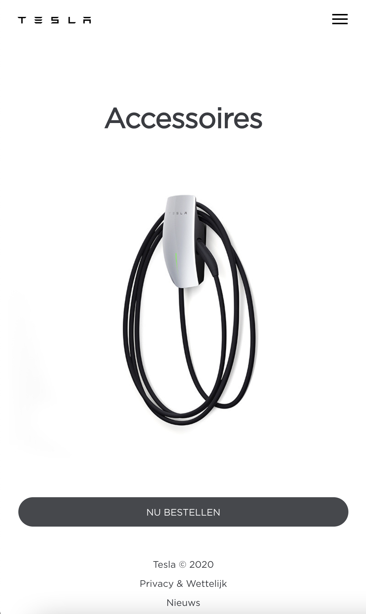
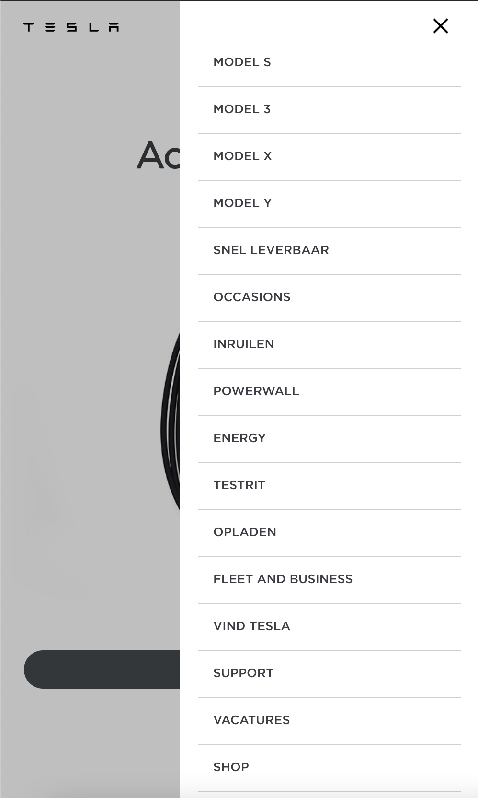
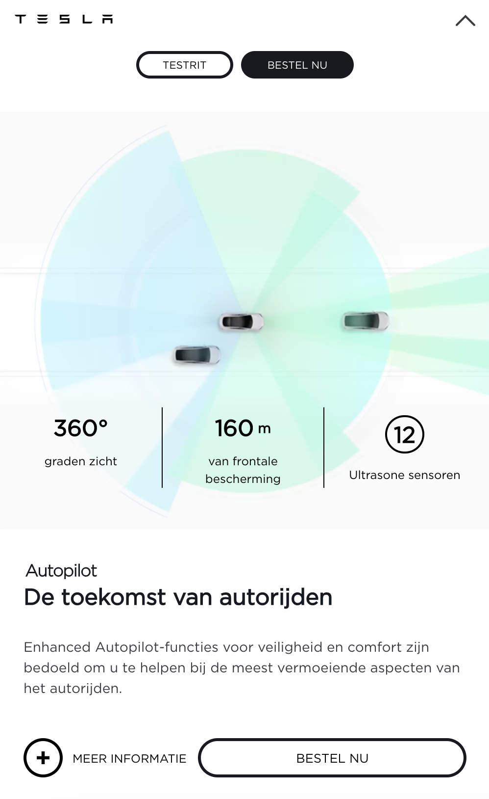
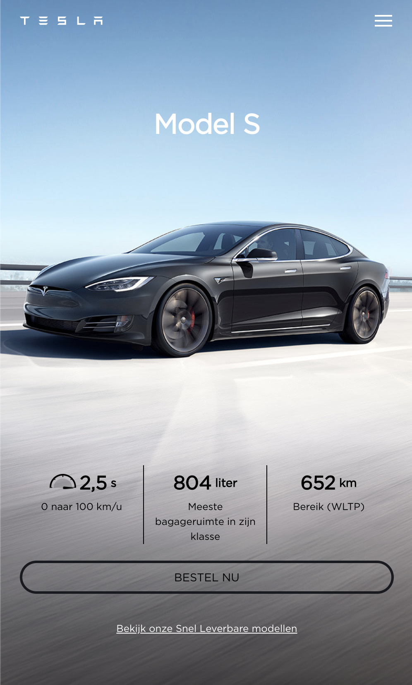
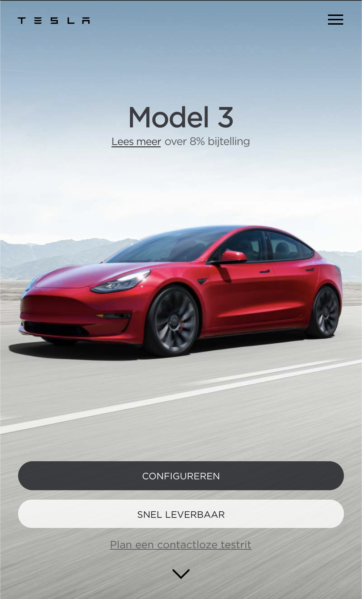
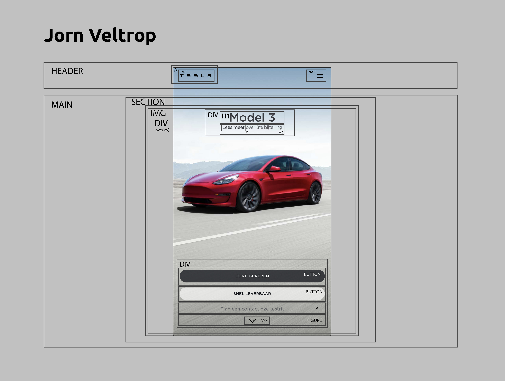
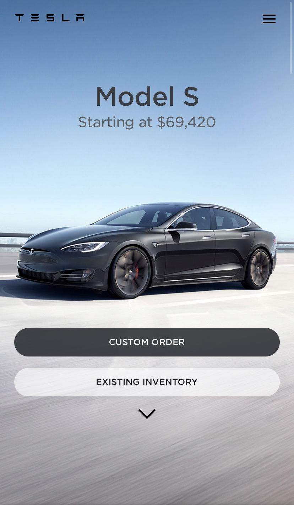
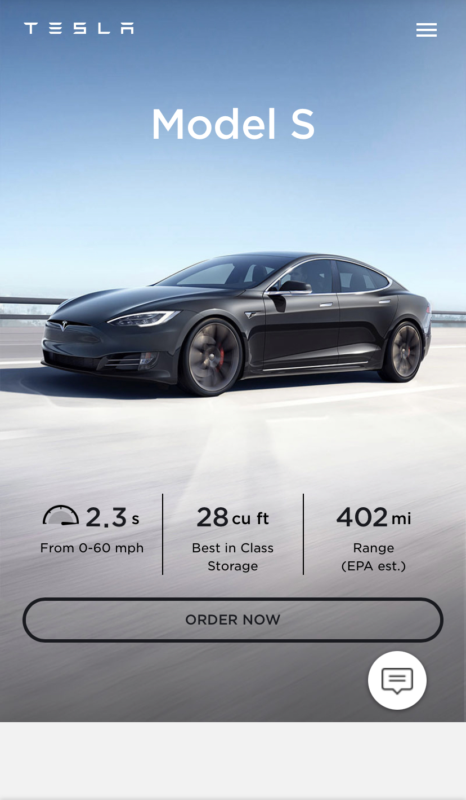

# Procesverslag
**Auteur:** Jorn Veltrop\s\s
**Klas:** 206B

**Datum:** 6 - 1 - 2021

**Docent:** Robert Spier

**Vak:** Front-end development

**Blok:** Blok 2 Web

**Schooljaar:** 2

https://jornveltrop.github.io/web-fed-jornveltrop-206-tesla/

## Bronnenlijst
1. Speedometer SVG icon's Tesla: https://www.tesla.com/nl_nl/models

## Eindgesprek (week 7/8)

Alles is af, ik vond het een super leuk project! Ik heb veel geleerd. Ik zie het elke keer als een leuke uitdaging om het volgende probleem op te lossen **Ik voel mij Nikola Tesla.**

**Screenshots:**

## Voortgang 3 (week 6)

Ik moest een aantal semantische aanpassingen doen. Zoals de sections vervangen voor articles. En nog wat h2's omwisselen met h3's.

Verder ga ik de komende week aan de slag met de laatste dingen van de 2e pagina (Model S). Zoals de geanimeerde Speedometer.

## Voortgang 2 (week 5)

Weinig op- en aanmerkingen. De opacity scroll-snap is nu ook responsive. Ik moet vooral aan de slag met de 2e pagina. Pagina 1 is nu helemaal af. Responsive & Surface. 

## Voortgang 1 (week 3)

### Stand van zaken

Qua design gaat alles goed. Er zitten alleen nog wat bugs in de opacity animatie die gelinkt is aan scrollen. Deze is namelijk nog niet responisve. Daarvoor moet ik zelf een formule voor gaan schrijven. **Ik voel mij Albert Einstein.**

**Screenshot:**

Het begint al ergens op te lijken!

## Breakdownschets (week 1)

## Intake (week 1)

**Je startniveau:** rood

**Je focus:** surface plane (animaties) [En toch ook een beetje responsive. Ik kon het niet laten.]

**Je opdracht:** https://www.tesla.com/

**Screenshot van de eerste pagina (small screen):**

**Screenshot van de tweede pagina (small screen):**

